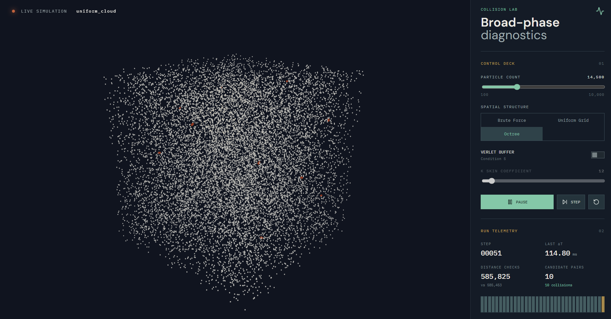

# N-body粒子碰撞偵測系統



大學專題：在**不改變碰撞判定正確性**的前提下，比較 broad-phase 空間分割結構（Uniform Grid、Octree）結合 Verlet List 自適應 skin 機制，對重建次數、候選配對數與執行效能的影響。

| 資料夾 | 內容 |
|---|---|
| `collision/` | 核心演算法、benchmark 與正確性測試（C++） |
| `system/` | 互動式 3D 可視化展示（TypeScript、React、React Three Fiber） |

---

## collision

### 演算法概要

- **Broad-phase**：Uniform Grid（hash map 稀疏格子，只查 13 個前向鄰格）或 Octree（葉節點超過容量即分裂，以包圍盒剔除），篩出候選配對。
- **Narrow-phase**：以 `(r_a + r_b)² ≥ |pos_a − pos_b|²` 精確判定。
- **Brute Force**：O(n²) 全配對，作為正確性基準。

**Verlet List 與自適應 skin（本專題核心）**：每個粒子在半徑外維護一層緩衝區 skin，位移未超出 skin 前沿用既有候選、跳過 broad-phase 重建。

| 項目 | 說明 |
|---|---|
| skin 計算 | `K·\|v\|·Δt + ½·\|a\|·(K·Δt)²`，只在重建時計算 |
| 重建判定 | 任一粒子累積位移超過自身 skin 即全域重建 |
| Uniform Grid 上界 | `cellSize/2 − radius`，確保兩粒子相向移動時不漏抓 |
| Octree 上界 | `葉節點半邊長 − radius`，避免密集區候選數膨脹 |
| 候選判定 | `(r_a + skin_a) + (r_b + skin_b)`，涵蓋兩粒子各自的 skin |

### Benchmark

粒子數 10000、1000 幀、單執行緒；對 K ∈ {1, …, 1000} 掃描 UG／OT（有無 skin），每組重複 10 次取平均，並逐幀比對暴力法。結果見 `info/`：

| 檔案 | 場景 |
|---|---|
| `benchmark.csv` | 均勻／低速差 |
| `benchmark2.csv` | 群聚／低速差 |
| `benchmark3.csv` | 均勻／高速差 |
| `benchmark4.csv` | 群聚／高速差 |

**K = 100 摘要**（UG = Uniform Grid、OT = Octree）

| 場景 | 重建次數 UG／OT | 平均候選數 UG／OT | 總執行時間 UG／OT (s) |
|---|---|---|---|
| 均勻／低速差 | 70／28 | 56,752／343,152 | 0.414／1.145 |
| 群聚／低速差 | 258／194 | 293,765／532,434 | 2.145／4.550 |
| 均勻／高速差 | 1000／500 | 57,556／370,755 | 3.826／10.203 |
| 群聚／高速差 | 1000／513 | 70,426／391,848 | 4.002／11.147 |

所有設定下皆與暴力法結果完全一致（`correctness_ok = 1`）。

### 建置與執行

需求：CMake ≥ 3.14、C++17（`glm` 已內附）。

```bash
cd collision && mkdir -p build && cd build
cmake .. && cmake --build .
./bench              # 輸出 benchmark.csv
./test_correctness   # 逐幀比對暴力法，輸出 PASS / FAIL
```

---

## system

以 `collision/` 為基礎的互動式 3D 展示，skin 計算、上界限制與重建判定皆與 C++ 端一致，並以 Vitest 單元測試驗證候選配對與暴力法等價。

```bash
cd system
npm install
npm run dev     # 啟動開發伺服器
npm test        # 執行單元測試
```