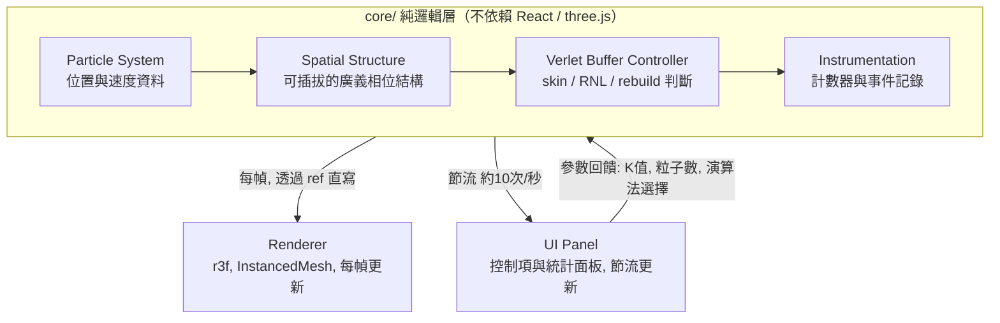

# 碰撞偵測方法比較 — 互動式展示 Demo 規格書

版本：v1.1（初稿）
用途：交付給 VS Code 內的 Claude Code 進行專案生成與實作
定位：**展示性質大於實驗性質**，但保留與研究數據交叉驗證的能力

---

## 0. 實作參考來源

專案根目錄下的 **`/collision`** 資料夾包含既有的 C++ 研究實作（LinkedCell broad-phase + Verlet buffer），已完成正確性驗證（與 brute force ground truth 比對無誤）。Claude Code 實作本 demo 時，**應優先參考 `/collision` 內的邏輯**，而非單純依賴論文公式重新推導，原因：

- `/collision` 內已修正過兩個關鍵正確性 bug：
  1. `capSkinToCellSize` 上限應為 `cellSize/2 - radius`（非 `cellSize - radius`），需考慮兩顆粒子延伸半徑相加的情況
  2. skin 模型（`applySkinModel`）只能在 rebuild 當下套用，不可每步都套用，否則違反正確性證明的前提
- 變數命名（`RC`、`RNL`、`skin`、`K`）與觸發條件（Condition 5）應與 `/collision` 保持一致，方便未來兩端交叉驗證
- 若 demo 中的 TypeScript 實作與 `/collision` 的 C++ 邏輯出現行為差異，應以 `/collision` 為正確性基準來源進行核對，而非各自獨立發展

若 `/collision` 資料夾在實際專案生成時不存在或路徑不同，Claude Code 應向使用者確認正確路徑，而非略過此步驟直接憑論文重新實作。

---

## 1. 專案目的

本 demo 是大學專題「碰撞偵測方法比較（Collision Detection Method Comparison）」的口頭報告輔助工具，目標是讓聽眾在幾分鐘內直觀理解：

1. 不同空間分割結構（Brute Force / Uniform Grid / 未來的 Octree）如何影響 broad-phase 碰撞偵測效能
2. Verlet buffer 機制（skin、RNL、rebuild 觸發條件）如何在不改變正確性的前提下降低計算成本——**這是目前研究中已確定會展示的一種方法，但不是本 demo 的唯一主題**。研究本身可能延伸出其他降低計算成本的機制，demo 架構應保持開放，不預設 Verlet buffer 是終點
3. 上述兩者是**正交的兩個貢獻**：換結構、加額外機制（如 buffer），是兩件可以分開展示效益的事

demo 的次要目標是**對研究本身有幫助**：架構需具備良好擴充性，讓之後可以拿它跟既有 C++ 實作交叉驗證邏輯正確性，並在需要時疊代擴充新的比較方法。

### 研究範疇邊界（重要）

本專題明確排除重力／N-body 物理敘事。demo 中的粒子運動僅作為**碰撞偵測測試資料生成**，一律使用「邊界反彈 + 隨機初速度」模型，畫面、UI 文案、變數命名皆不得出現重力、星體、N-body 等敘事或視覺暗示。

---

## 2. 技術棧

| 項目 | 決定 |
|---|---|
| 語言 | TypeScript（第一版即採用，型別細節於實作階段決定） |
| UI 框架 | React |
| 3D 渲染 | React Three Fiber (r3f) + drei |
| 建置工具 | Vite |
| 狀態管理 | Zustand（transient 更新，避免 per-frame React re-render） |
| 高效能運算 | 第一版純 TypeScript。`core/` 層已設計為可替換邊界，**WASM/C++ 為明確列出的未來擴充選項**，非本版範圍 |

---

## 3. 架構分層

系統切分為六個邏輯層，展示層與邏輯層物理隔離：



**分層原則**：
- `core/` 完全不 import React 或 three.js，可獨立寫單元測試，也可整包替換為 WASM 模組
- Renderer 透過 `useFrame` 直接讀取 core 層資料寫入 three.js 物件（`InstancedMesh` 的 matrix），**不經過 React state**，避免 5000 顆粒子每幀觸發 re-render 造成畫面卡死
- UI 面板只在節流後的頻率（建議每秒 4~10 次）更新 React state，因為人眼無法辨識更高頻率的數字跳動，強行每幀更新是不必要的效能浪費

---

## 4. 核心介面定義

以下介面是規格書最關鍵的部分，Claude Code 實作時應嚴格遵守，未來擴充新結構或新機制時只需新增實作，不應修改介面本身。

### 4.1 SpatialStructure（可插拔的空間結構介面）

```typescript
interface SpatialStructure {
  build(particles: ParticleData[]): void;       // 從頭建立結構
  queryCandidatePairs(): [number, number][];     // 回傳 broad-phase 候選對（粒子索引配對）
  getDebugGeometry(): DebugGeometry;              // 回傳格線/節點邊界，供 Renderer 繪製疊圖
  getMetrics(): { distanceChecks: number };       // 本次 query 的計算量統計
}
```

- Phase 0 需實作：`BruteForceStructure`、`UniformGridStructure`
- **命名對齊研究端**：`UniformGridStructure` 必須是真正的顯式陣列索引格子（array-indexed grid），**不可**是 hash-based 的 spatial hashing 實作，以維持與研究端命名修正後的一致性
- Phase 2 追加：`OctreeStructure`（需注意 `maxDepth` 終止條件，避免密集粒子分佈時的無限遞迴，此為研究端已知並修正過的 bug）

### 4.2 VerletBufferController

變數命名直接對應論文符號（RC、RNL、skin、K），不做語意翻譯，方便與 C++ 端程式碼對照除錯：

```typescript
class VerletBufferController {
  RC: number;                              // cutoff radius
  K: number;                               // skin 係數
  computeSkin(particle: ParticleData): number;   // skin = K * v * dt
  isListValid(): boolean;                  // Condition 5: ∀p, Δxp ≤ skinp
  rebuild(structure: SpatialStructure): RebuildEvent;  // 觸發重建，回傳事件供 log 使用
}

interface RebuildEvent {
  step: number;
  triggeredByParticleId: number;
  displacement: number;
  skinAtTrigger: number;
}
```

Buffer 為**正交機制**：可獨立套用在任何一種 `SpatialStructure` 實作上，不綁定特定結構。

### 4.3 Instrumentation

```typescript
interface Instrumentation {
  recordStep(metrics: StepMetrics): void;
  getEventLog(): LogEntry[];
  exportJSON(): string;   // 供與 C++ benchmark 的 CSV 交叉比對
}
```

---

## 5. 效能比較設計

### 5.1 比較矩陣

以「空間結構」與「Verlet buffer 開關」作為兩個正交維度：

| | Buffer 關（每步 rebuild） | Buffer 開（依 Condition 5 skip） |
|---|---|---|
| **Brute Force** | Phase 0 | Phase 1 |
| **Uniform Grid** | Phase 0 | Phase 1 |
| **Octree** | Phase 2 | Phase 2 |

### 5.2 指標策略

**不主打 wall-clock 時間**（瀏覽器環境雜訊大、不同展示現場設備效能不一），改以**確定性計數指標**為主：

- Distance check 次數（本步 / 累積）
- Candidate pair 數 / 實際 collision 數（narrow-phase 命中率）
- Rebuild 次數、skipped rebuild 比例
- 每步計算耗時（僅作為「這一步算了多久」的即時資訊呈現，不作為 fps 驗收標準）

---

## 6. 開發階段規劃

### Phase 0 — 基準比較（優先做扎實）
- 空間結構：Brute Force、Uniform Grid（**不含** Verlet buffer，每步皆重新執行 broad-phase）
- 場景：僅 `uniform_cloud`
- 3D 渲染：立方體容器、粒子反彈、固定視角
- Control Panel：粒子數 slider（1000~5000）、演算法選擇器（二選一）、Play/Pause/Step/Reset
- Stats Panel：兩種結構的 distance check 次數、candidate pair 數對照

### Phase 1 — 疊加 Verlet Buffer
- 任一結構皆可獨立開關 Verlet buffer，形成 2×2 比較矩陣
- 新增控制項：Buffer 開關、K 值 slider、Skin 殼顯示開關
- 新增 Event Log 面板，記錄 rebuild 觸發事件
- Stats Panel 追加：rebuild 次數、skipped 比例、歷史對照（數字對比為主標題、疊圖為進階細節）

### Phase 2 — 未來擴充（規格層級預留，非本版實作範圍）
- Octree 結構（`SpatialStructure` 新實作）
- 其他場景：`free_fall`、`mixed_regime`、`explosion`
- 其他演算法（如 Sweep and Prune）
- 自由視角（drei `OrbitControls`）
- WASM/C++ 核心運算模組
- 外部軌跡資料回放（讀取 C++ benchmark 輸出，取代即時模擬）

---

## 7. 場景設計

場景一律採用資料驅動的 config 格式，命名對齊研究端既有的四個 benchmark 情境（本版僅實作 `uniform_cloud`，其餘留空間）：

```typescript
interface ScenarioConfig {
  name: 'uniform_cloud' | 'free_fall' | 'mixed_regime' | 'explosion';
  particleCount: number;
  boundingBox: { x: number; y: number; z: number };
  initialVelocityDistribution: 'uniform_random' | ...;  // 依場景擴充
}
```

`uniform_cloud`：粒子在立方體容器內均勻分布，初速度隨機、方向均勻，邊界反彈。

---

## 8. UI/UX 規格

### 8.1 版面配置
- 左右分割：左側 3D 場景（滿版）、右側固定寬度的控制/數據面板
- 3D 場景：固定視角（Phase 0/1），Phase 2 開放 `OrbitControls` 自由旋轉/縮放

### 8.2 Control Panel 控制項清單
- 粒子數 slider（1000~5000）
- 演算法選擇器（segmented control：Brute Force / Uniform Grid，Phase 2 追加 Octree）
- Verlet Buffer 開關（Phase 1 啟用；Phase 0 隱藏或 disable）
- K 值 slider（僅 buffer 開啟時可調，K = skin 係數）
- Skin 殼顯示開關（獨立按鈕，全域生效，非點選才顯示）
- Play / Pause、Step（單步）、Reset
- 場景選擇下拉選單（目前僅 `uniform_cloud`，UI 預留擴充）

### 8.3 Stats Panel 欄位
- 目前 step 數
- 本步計算耗時（非 fps）
- Distance check 次數（本步 / 累積）
- Candidate pair 數 / 實際 collision 數
- Rebuild 次數、skipped rebuild 比例（Phase 1）
- 「上一次 vs 這一次」數字對照（主標題）+ 折線疊圖（進階細節，舊線變淡保留、新線疊上）

### 8.4 Event Log 面板
可捲動文字流水帳，格式對應論文符號，方便與 C++ 端程式碼交叉核對：

```
Step 142: Rebuild triggered — Particle #37 exceeded skin (Δx=0.82 > skin=0.75)
```

觸發當下，3D 場景中對應粒子的 skin 殼短暫脈動一次（視覺化的 rebuild 事件）。

### 8.5 粒子視覺狀態
- 正常：中性色（灰階）
- 位於 candidate pair 中：強調色（青）
- 實際碰撞（narrow-phase 命中）：警示色（珊瑚紅），短暫閃爍
- Skin 殼：全域開關控制顯示，開啟時所有粒子顯示半透明 skin 殼（琥珀色虛線輪廓）

---

## 9. 視覺設計 Token

定位為「科學儀器 / 診斷工具」，非行銷頁面，避免落入常見 AI 生成設計套路（暖米色+襯線字、純黑+單一霓虹色）。

| 用途 | 色值 |
|---|---|
| 背景 | `#0D1420`（深藍灰，非純黑） |
| 格線 | `#2A3F4A`（低飽和青） |
| 粒子本體 | `#EDEAE2`（暖白） |
| Skin 殼 | `#D9A441`（琥珀虛線） |
| Candidate pair 連線 | `#5DCAA5`（青） |
| 實際碰撞 | `#D85A30`（珊瑚紅） |

- **字體**：數據面板、Event Log 使用等寬字體（如 JetBrains Mono），標題/控制項標籤使用克制的無襯線字
- **簽名元素**：rebuild 觸發瞬間的視覺脈動（格線短暫閃爍 + 觸發粒子 skin 殼脈動一次），為此 demo 唯一刻意強調的動態效果，其餘部分維持克制、無多餘裝飾動畫

---

## 10. 擴充性設計原則

本節為規格書核心，明確列出系統為何具備擴充性，以及未來新增功能時應該修改的邊界：

1. **空間結構可插拔**：所有結構實作 `SpatialStructure` 統一介面。新增 Octree、Sweep and Prune 等結構時，僅需新增一個實作類別於 `core/spatial/`，不需修改 Renderer 或 `VerletBufferController`。

2. **邏輯層與展示層物理隔離**：`core/` 資料夾不依賴 React 或 three.js。未來若需替換渲染框架，或將效能瓶頸模組（如 brute force 距離運算）替換為 WASM/C++ 實作，理論上僅需替換 core 層內部實作，不動介面。

3. **場景資料驅動**：情境以 `ScenarioConfig` 描述初始條件。新增 `free_fall`、`mixed_regime`、`explosion` 等場景時，僅需新增 config，不需修改模擬邏輯。

4. **額外機制正交於空間結構**：Verlet buffer 是目前研究中**已確定**會實作的第一個「降低計算成本的額外機制」，其開關獨立於選用的結構，任何空間結構皆可直接套用同一套 `VerletBufferController`。研究後續可能延伸出其他機制（目前尚未定案，也可能與規格書設想的方向不同），因此 `VerletBufferController` 的設計不應假設它是唯一的機制擴充點——未來若有新機制，應能以類似的「獨立開關、可套用於任一結構」模式加入，而不需要重構既有的 Brute Force / Uniform Grid / Verlet buffer 邏輯。

5. **資料來源可替換**：`ParticleSystem` 預設由 TypeScript 內建物理模擬驅動，但介面預留「載入外部軌跡資料」的 hook，未來可直接匯入 C++ benchmark 輸出的真實模擬資料做視覺化回放與比對，而非重新以近似模型模擬。

6. **Instrumentation 可匯出**：所有統計數據可匯出為 JSON，格式設計上便於與 C++ 端輸出的 CSV benchmark 資料進行交叉驗證，用於檢驗兩端邏輯一致性。

---

## 11. 非功能需求

- **Real-time 行為**：粒子運動與 broad-phase 計算為連續即時進行，非批次模式（非按一次按鈕才跑一次）
- **Fps 彈性**：不強制固定 60fps。高負載情境（如 brute force 於高粒子數下）允許畫面適度卡頓 —— 此卡頓本身即為展示 brute force 計算成本的一部分，不視為缺陷
- **渲染效能策略**：粒子渲染一律使用 `InstancedMesh`；模擬計算時脈與渲染時脈解耦，避免計算緩慢時連帶拖垮畫面幀率
- **正確性**：Verlet buffer 邏輯需符合論文 Condition 5（`∀p, Δxp ≤ skinp`），變數命名對應 `RC`、`RNL`、`skin`、`K` 等論文符號

---

## 12. 專案資料夾結構（建議）

```
src/
├── core/                          # 純邏輯，不依賴 React/Three.js
│   ├── ParticleSystem.ts
│   ├── spatial/
│   │   ├── SpatialStructure.ts    # 介面定義
│   │   ├── BruteForceStructure.ts
│   │   └── UniformGridStructure.ts  # 真正的 array-indexed grid
│   ├── VerletBufferController.ts
│   └── metrics/
│       └── Instrumentation.ts
├── store/
│   └── simulationStore.ts         # Zustand，transient 更新
├── scenes/                        # r3f 場景元件
│   ├── SimulationCanvas.tsx
│   ├── ParticleField.tsx          # InstancedMesh
│   └── SkinShells.tsx
├── ui/
│   ├── ControlPanel.tsx
│   ├── StatsPanel.tsx
│   └── EventLog.tsx
└── scenarios/
    └── uniformCloud.ts
```

---

## 13. 本版明確排除範圍（供 Claude Code 判斷優先順序）

以下項目**不屬於本版（Phase 0/1）實作範圍**，規格已預留擴充空間但不需在第一輪實作：

- Octree 結構
- `free_fall` / `mixed_regime` / `explosion` 場景
- Sweep and Prune 或其他演算法
- 自由視角相機控制
- WASM/C++ 整合
- 外部軌跡資料回放
- 固定 60fps 保證機制

---

## 14. 待確認事項（留給後續討論或實作階段決定）

- Zustand store 的精確 slice 劃分
- TypeScript 型別細節（交由實作階段 vibe coding 決定）
- Skin 殼於 3D 場景中的幾何精確畫法（半透明球殼 vs 線框）
- 是否需要行動裝置/窄螢幕的版面適配（目前預設桌面簡報情境）